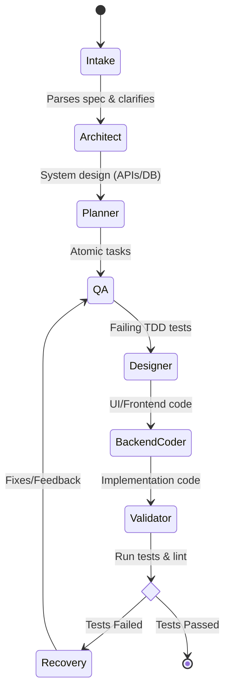

# Agentic Pipeline Execution Graph

Below is the execution graph of your project's pipeline, built using LangGraph as defined in your orchestrator architecture.

## Agent Roles

1. **Intake**: Clarifies the user specification and asks questions.
2. **Architect**: Designs the system architecture, folders, and APIs.
3. **Planner**: Breaks the architecture into atomic, testable tasks.
4. **QA (TDD)**: Writes failing pytest test cases first for the given tasks.
5. **Designer**: Generates the UI layouts, components, and styling.
6. **Backend Coder**: Writes the implementation code to make the tests pass.
7. **Validator**: Runs pytest and linting to verify the code.
8. **Recovery**: Analyzes failures and proposes fixes, looping back to QA.
